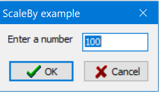

# An High-DPI example (components are scaled)

Shows how to create an application that has a form created dynamically at runtime.

1. Create a project (File | New | VCL Forms Application). A project with 5 files (Project1.cpp, Project1.res and Unit1.cpp(and .h and .dfm)) will be created.
2. Remove the Unit1.cpp (and h /dfm) files from project (in Project manager right-click on unit and choose Remove from Project).
3. Add the [src/main_form_dynamic.cpp](main_form_dynamic.cpp) file from this folder (Right click on Project name inside the Project Manager and choose Add).
4. Replace the content of the Project1.cpp with the content of the [src/project.cpp](project.cpp) file from this folder.
5. Add the [resources.rc](resources.rc) file to the project.
6. Compile it and Run it (Press F9).

A screenshot of the result should be:

